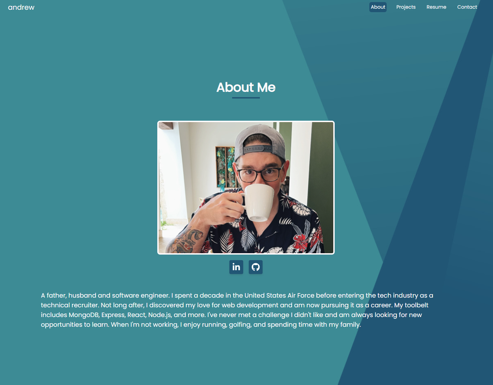
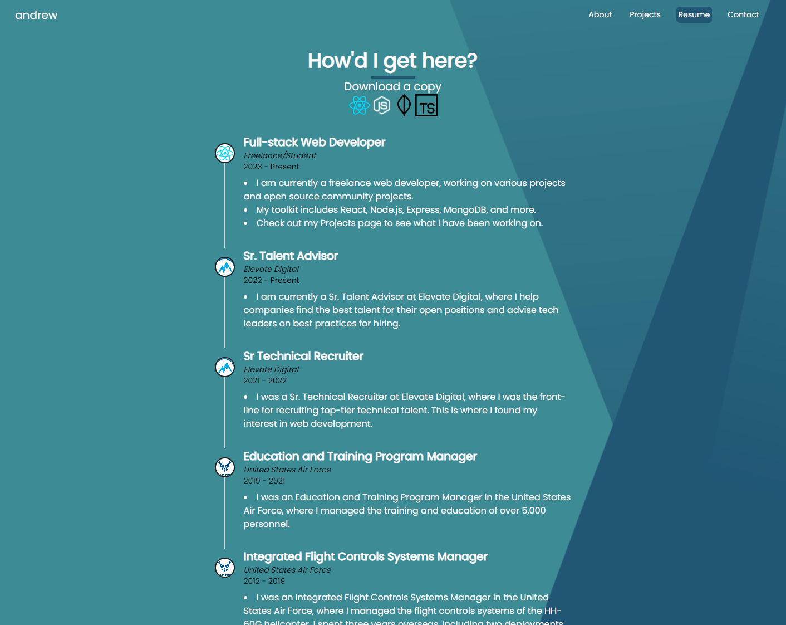

# Personal Portfolio

## License

## Description
This is a personal website/portfolio built using React, Tailwind CSS and HeadlessUI.

## Live Site

You can view the live site [here](https://www.andrewmonson.net)

## Screenshots

## Table of Contents
* [License](#license)
* [Contact](#contact)

## Contact
Link to my [Github](https://github.com/AndrewCMonson)

Email me [here](mailto:andrew.c.monson@gmail.com)